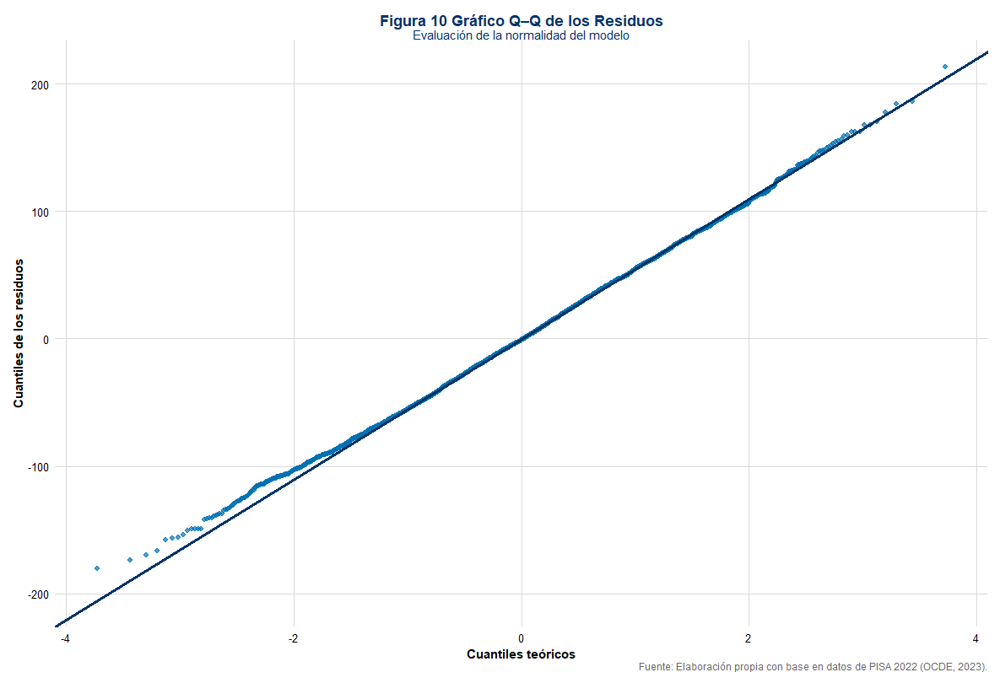

# 📊 Análisis del Rendimiento Matemático en Costa Rica: Datos PISA 2022
 
[](https://www.r-project.org/)
[](https://github.com/tu-usuario/PISA-Math-Performance-Costa-Rica)
[](https://opensource.org/licenses/MIT)
[](https://github.com/tu-usuario/PISA-Math-Performance-Costa-Rica)

## 🎯 Objetivo del Proyecto

Identificar y cuantificar los factores socioemocionales, disciplinarios y estructurales que influyen en el rendimiento matemático de estudiantes costarricenses mediante análisis estadístico riguroso de datos PISA 2022.

---

## 📖 Descripción

Este proyecto analiza el desempeño en matemáticas de **6,113 estudiantes costarricenses** usando datos del Programa para la Evaluación Internacional de Alumnos (PISA) 2022. A través de regresión lineal múltiple, se identifican predictores clave del rendimiento académico, incluyendo factores emocionales, ambientales y estructurales del sistema educativo.

### ¿Por qué es importante?

El rendimiento matemático no depende únicamente de habilidades cognitivas. Este análisis revela que **factores modificables** como la ansiedad matemática, el clima disciplinario y la prevención del bullying tienen impactos medibles en los resultados académicos, ofreciendo evidencia para **intervenciones educativas basadas en datos**.


---
---

## 📊 Dataset

- **Fuente**: PISA 2022 - OECD
- **País**: Costa Rica
- **Tamaño de muestra**: 6,113 estudiantes
- **Variables analizadas**: 5 predictores + 1 variable respuesta
- **Tipo**: Datos públicos de acceso abierto

### Variables del Modelo

| Variable | Descripción | Tipo |
|----------|-------------|------|
| `mat` | Puntaje estandarizado en matemáticas (0-800, μ=500, σ=100) | Continua |
| `pro_an` | Ansiedad matemática (promedio de 6 ítems) | Continua |
| `pro_cd` | Clima disciplinario (promedio de 6 ítems) | Continua |
| `pro_bu` | Recepción de bullying (promedio de 6 ítems) | Continua |
| `sex` | Sexo del estudiante (Masculino/Femenino) | Categórica |
| `pub` | Tipo de institución (Privada/Pública) | Categórica |

---

## 🔬 Metodología

### Análisis Estadístico

1. **Análisis Exploratorio de Datos (EDA)**
   - Estadística descriptiva de todas las variables
   - Visualización de distribuciones y relaciones bivariadas
   - Análisis de correlaciones

2. **Modelado de Regresión Lineal Múltiple**
   - Estimación de modelo con 5 predictores
   - Selección de variables mediante:
     - Forward selection
     - Backward elimination
     - Stepwise selection
   - **Resultado**: Los tres métodos convergieron en el mismo modelo óptimo
   - Criterio AIC ≈ 40,403

3. **Validación de Supuestos**
   - ✅ **Normalidad**: Q-Q plot + Shapiro-Wilk (p=0.016) + Kolmogorov-Smirnov (p=0.41) → Aproximadamente normal
   - ✅ **Homocedasticidad**: Breusch-Pagan (p<0.001) → Ligera heterocedasticidad (común en grandes muestras educativas)
   - ✅ **Independencia**: Durbin-Watson (p=0.40) → Residuos independientes
   - ✅ **Linealidad**: Gráficos de regresión parcial confirman relaciones lineales
   - ✅ **Multicolinealidad**: VIF < 5 en todas las variables

### Herramientas y Tecnologías

- **Lenguaje**: R (versión 4.5.2)
- **Entorno**: RStudio, R Markdown
- **Paquetes principales**:
  - `tidyverse`, `dplyr`, `ggplot2` - Manipulación y visualización
  - `lmtest`, `car`, `MASS` - Diagnóstico de modelos
  - `corrplot`, `RColorBrewer` - Visualizaciones especializadas
  - `performance`, `broom` - Evaluación de modelos

---

## 📈 Resultados Principales

### Rendimiento del Modelo

- **R² = 0.21** (21% de varianza explicada)
- **p-value < 2.2e-16** (modelo globalmente significativo)
- **AIC = 40,403**

> **Nota sobre R²**: En ciencias sociales y educación, valores de R² entre 0.10-0.30 son típicos y aceptables debido a la naturaleza multifactorial del comportamiento humano. El 79% de varianza no explicada incluye factores como habilidad innata, motivación intrínseca, calidad docente, ambiente familiar y otros elementos no medidos.

### Coeficientes del Modelo

| Predictor | Coeficiente (β) | p-value | Interpretación |
|-----------|----------------|---------|----------------|
| **Ansiedad Matemática** | -14.84 | <0.001 | Mayor ansiedad → 14.84 pts menos |
| **Clima Disciplinario** | +3.29 | 0.002 | Mejor clima → 3.29 pts más |
| **Bullying** | -3.57 | 0.041 | Mayor bullying → 3.57 pts menos |
| **Sexo (Femenino)** | -10.05 | <0.001 | Mujeres obtienen 10.05 pts menos |
| **Institución (Pública)** | -73.78 | <0.001 | Sector público → 73.78 pts menos |

### Hallazgos Clave

1. **Factor emocional dominante**: La ansiedad matemática es el predictor socioemocional más fuerte, con casi 15 puntos de impacto por unidad de cambio.

2. **Brecha institucional crítica**: Los estudiantes de colegios públicos obtienen en promedio **74 puntos menos** que los del sector privado, señalando inequidad estructural significativa.

3. **Clima escolar importa**: Un ambiente disciplinado y libre de acoso tiene efectos positivos medibles en el rendimiento.

4. **Brecha de género persistente**: Las estudiantes mujeres obtienen 10 puntos menos en promedio, incluso controlando por otros factores.

---

## 📊 Visualizaciones

El proyecto incluye 12 figuras que documentan todo el proceso analítico:

- **Figura 1**: Distribución de puntajes matemáticos
- **Figuras 2-3**: Distribuciones de variables predictoras y matriz de correlación
- **Figuras 4-8**: Relaciones bivariadas entre predictores y rendimiento
- **Figura 9**: Coeficientes del modelo final con barras de error
- **Figuras 10-11**: Diagnóstico de residuos (Q-Q plot, residuos vs ajustados)
- **Figura 12**: Análisis de multicolinealidad (VIF)

### Ejemplos Visuales

<table>
  <tr>
    <td width="50%" align="center">
      
      <br>
    </td>
    <td width="50%" align="center">
      
      <br>
    </td>
  </tr>
  <tr>
    <td width="50%" align="center">
      
      <br>
    </td>
    <td width="50%" align="center">
      
      <br>
    </td>
  </tr>
</table>
---

## 💡 Implicaciones y Recomendaciones

### Para Política Educativa

1. **Intervención emocional**: Implementar programas de gestión de ansiedad matemática en todos los niveles educativos
2. **Equidad educativa**: Invertir en infraestructura y recursos para el sector público para reducir la brecha de 74 puntos
3. **Clima escolar**: Fortalecer políticas anti-bullying y promoción de ambientes disciplinados positivos
4. **Equidad de género**: Investigar y atender las causas de la brecha de rendimiento entre géneros

### Para Investigación Futura

- Incorporar **modelos multinivel** para capturar efectos de escuela y aula
- Explorar **métodos no paramétricos** o machine learning para manejar heteroscedasticidad
- Incluir **más variables contextuales**: nivel socioeconómico detallado, formación docente, recursos tecnológicos
- Análisis longitudinal para evaluar cambios en el tiempo

---

## 📁 Estructura del Repositorio

```
PISA-Math-Performance-Costa-Rica/
│
├── README.md                          # Este archivo
├── data/
│   ├── README.md                      # Descripción de datos y fuentes
│   └── pisa_2022_costarica.csv        # Dataset procesado
├── code/
│   └── analisis_regresion.Rmd         # Código completo del análisis
├── outputs/
│   ├── figures/                       # 12 figuras del análisis
│   └── modelo_final_summary.txt       # Salida del modelo
├── reports/
│   └── reporte_final.pdf              # Informe completo (opcional)
└── requirements.txt                   # Paquetes R necesarios
```

---

## 🚀 Cómo Reproducir este Análisis

### Prerrequisitos

- R (≥ 4.0.0)
- RStudio (recomendado)
- Paquetes listados en `requirements.txt`

### Instalación de Paquetes

```r
# Instalar paquetes necesarios
install.packages(c(
  "tidyverse", "dplyr", "ggplot2", "corrplot",
  "lmtest", "car", "MASS", "performance",
  "broom", "knitr", "RColorBrewer"
))
```

### Ejecución

1. Clonar el repositorio:
```bash
git clone https://github.com/tu-usuario/PISA-Math-Performance-Costa-Rica.git
cd PISA-Math-Performance-Costa-Rica
```

2. Abrir `code/analisis_regresion.Rmd` en RStudio

3. Ejecutar todos los chunks (Ctrl+Alt+R o Cmd+Option+R)

4. El análisis generará automáticamente todas las figuras y resultados

---

##  Referencias

- **OECD (2023)**. PISA 2022 Results. https://www.oecd.org/pisa/
- **Dataset**: PISA 2022 Database - Costa Rica subset

---

## 👤 Autor

**Luis Diego Chavarría-Brenes**

- 📧 Email: luisdiego.1703@gmail.com
- 💼 LinkedIn: www.linkedin.com/in/ldcb
- 🎓 Estudiante de Maestría en Estadística, Universidad de Costa Rica

---

## 📄 Licencia

Este proyecto utiliza datos públicos de PISA. El código y análisis están disponibles bajo licencia MIT.

---

## 🤝 Contribuciones

Este proyecto fue desarrollado como parte del curso "Métodos, Regresión y Diseño de Experimentos" en la Universidad de Costa Rica. Comentarios y sugerencias son bienvenidos.

---

## 📊 Estadísticas del Proyecto

- **Líneas de código**: ~500+
- **Tiempo de análisis**: ~40 horas
- **Figuras generadas**: 12
- **Modelos evaluados**: 3 (convergieron en 1)

---

** Si este proyecto te fue útil, considera darle una estrella en GitHub!**
